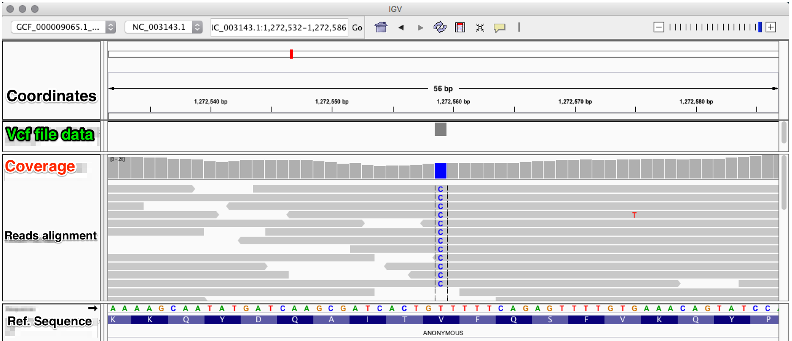

#################################
Variant calling and visualization
#################################

Once the reads are aligned and the data authenticated through post-mortem damage analysis, we can analyse the variant positions in the samples against the reference sequence.  

****************
Variants calling
****************

We will use two common tools for varaints calling: *samtools mpileup* in combination with *bcftools*. 
::

  samtools mpileup -B -ugf reference.fasta filename.final.sort.rescaled.bam | bcftools call -vmO z - > filename.vcf.gz

The detected genetic variations will be stored in the generated vcf file `output.vcf.gz`. These genetic variations can be filtered according to some criteria using bcftools:
::
  
  bcftools filter -O z -o filename.filtered.vcf.gz -s LOWQUAL -i'%QUAL>19' filename.vcf.gz

.. note::
  other options can be added when using bcftools filter: 
    
    ====================== ========
    Option                 Function
    ====================== ========
    *-g, --SnpGap* <int>   filter SNPs within <int> base pairs of an indel
    *-G, --IndelGap* <int> filter clusters of indels separated by <int> or fewer base pairs allowing only one to pass
    ====================== ========

Instead of samtools mpileup and bcftools (or in addition to) we can use *gatk HaplotypeCaller*:
::

  java -jar GenomeAnalysisTK.jar -T HaplotypeCaller -R reference.fasta -I filename.final.sort.rescaled.bam -o original.vcf.gz
  java -jar GenomeAnalysisTK.jar -T VariantFiltration -R reference.fasta -V filename.vcf.gz -o filename.filtered.vcf.gz --filterName 'Cov3|Qual20' --filterExpression 'DP>2'--filterExpression 'QUAL>19'

**********************
Variants visualization
**********************

To be able to visualize the identified variations in the vcf files in their context, you can use the program IGV that accepts multiple input files formats eg. fasta, bam, vcf and gff. After loading your bam file(s) and the corrsponding vcf file(s), this is what you will see:

 
As you can see, from the bam file we can see that there is a single nucleotide polymorphism (SNP) that corresponds to a T to C. This SNP is ofcourse represented in the vcf file data session of the igv viewer. 
